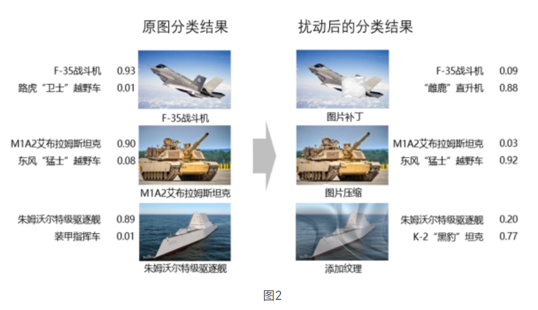
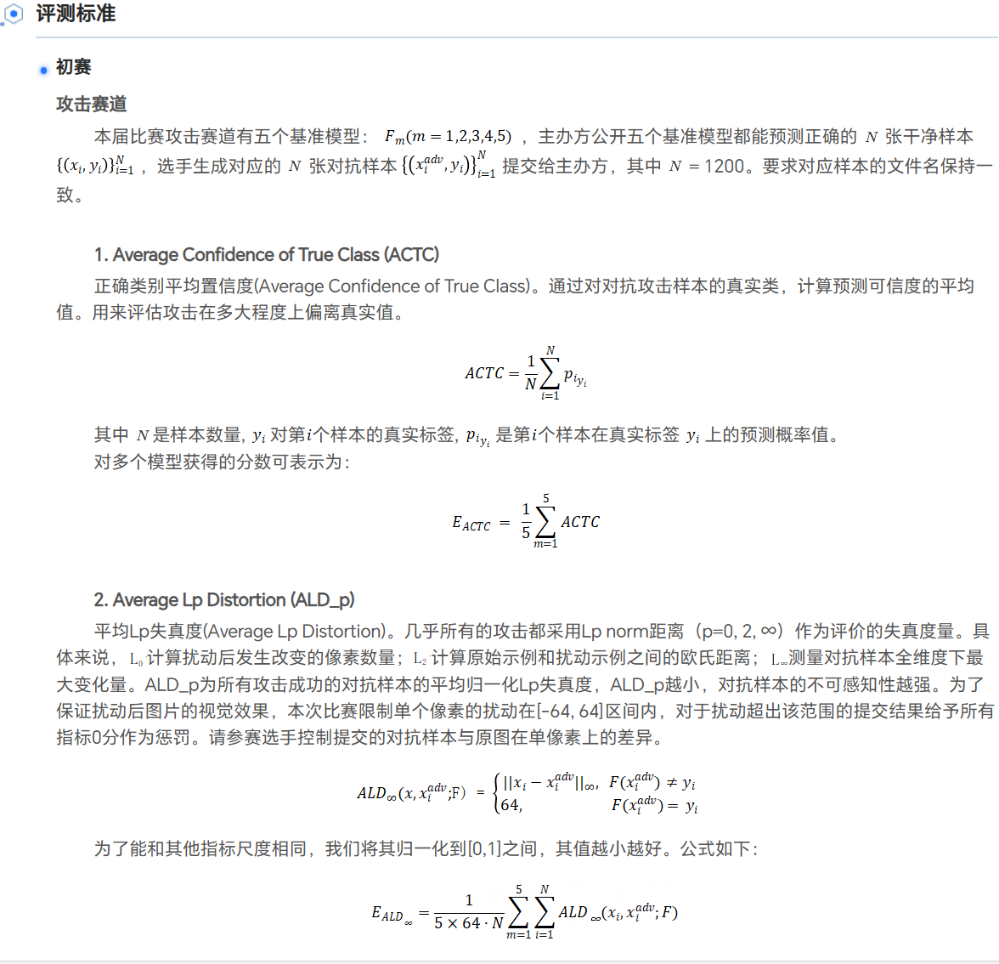
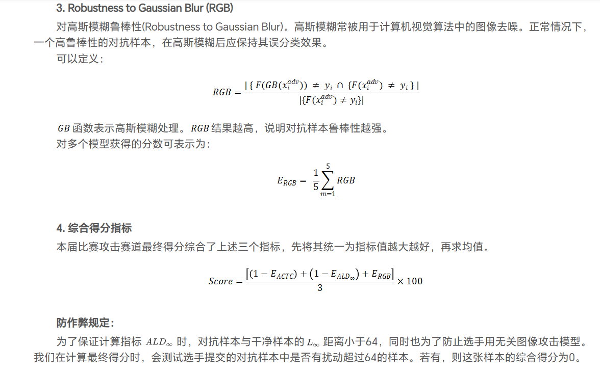
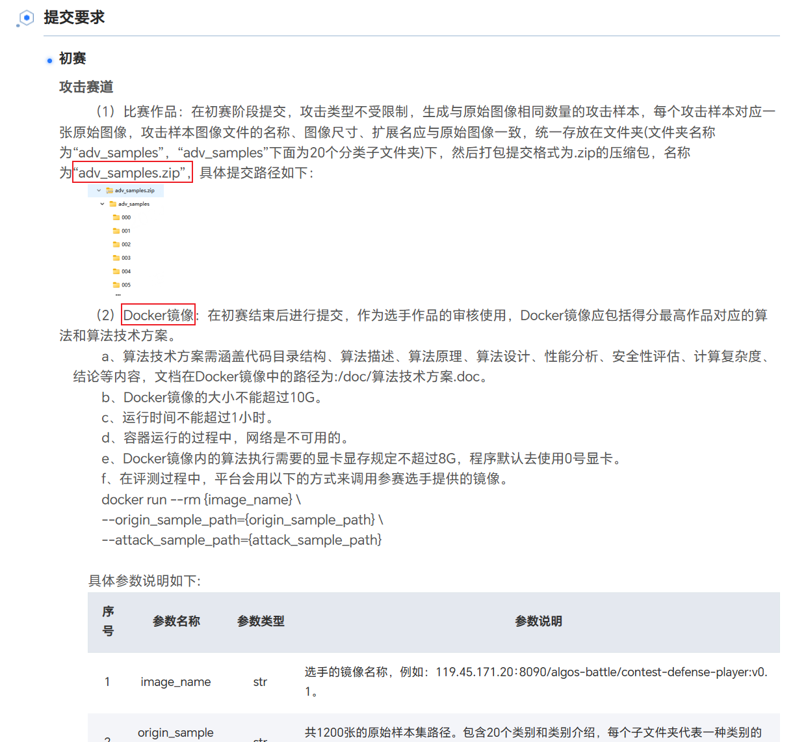
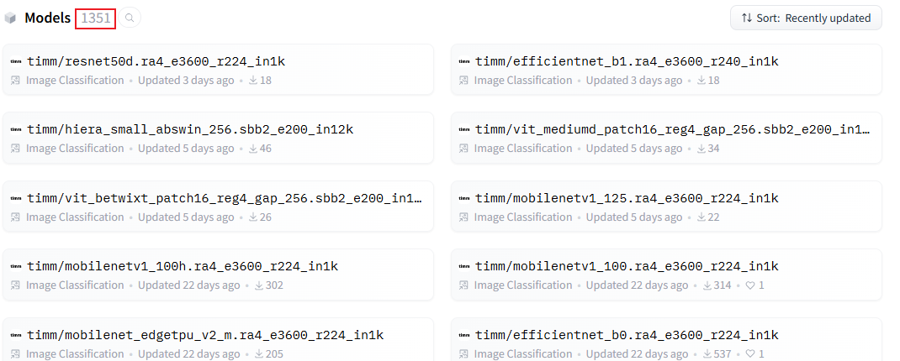

# 对抗挑战赛

[TOC]

## 1. 比赛要求

### 1.1 初赛

初赛的赛制是参赛选手和平台进行对抗，**不限制对抗样本攻击手段（加补丁、噪音等）**，针对海、陆、空等多目标识别的算法模型进行攻击。


### 1.2 复赛

复赛中除了使用初赛中的普通可见光数据集做分类外，还增加了遥感图像数据集做**目标检测。**

### 1.3 决赛

**线下比赛**，搭建物理沙盘，摆放高度逼真的军用车辆和基建模型，选手采用攻防对抗的方式进行比赛。使用在模型上**粘贴对抗样本补丁**的方式实现攻击，欺骗防御方的智能识别算法，躲避智能装备的打击。

## 2. 指标

  


## 3. 提交要求



## 4. How to use

### 4.1 划分数据集

在训练模型之前，使用`utils/split_dataset.py`按照8：2划分数据集。

```python
# split_dataset.py
import os
import shutil
import random

# 设置路径
data_dir = '/data/hdd3/duhao/data/datasets/attack_dataset/train'  # 你的数据集主文件夹
train_dir = '/data/hdd3/duhao/data/datasets/attack_dataset/phase1/train_set'  # 用于保存训练集的文件夹
test_dir = '/data/hdd3/duhao/data/datasets/attack_dataset/phase1/test_set'    # 用于保存测试集的文件夹
```

更改代码相应的路径，然后执行文件。

### 4.2 模型训练

模型训练，本项目基于hugging face提供的[timm](http://huggingface.co/timm)模块。


其提供了1351个模型供我们微调。

```shell
# scripts/train.sh
export HF_ENDPOINT=https://hf-mirror.com
python train.py --gpu "0,1,2,3" --arch "resnet101.a1h_in1k" --batch_size 1024 --lr 0.01 --epoch 65 --train_set "/home/heshiyuan/code/adversarial_competition/data/phase1/train_set" --test_set "/home/heshiyuan/code/adversarial_competition/data/phase1/test_set"
```

选择合适的模型，然后运行`bash scripts/train.sh`进行模型训练

### 4.3 生成对抗样本

执行`bash ensmeble_attack.sh`生成对抗样本。

## 5. Q&A

1. 在哪里查看实验记录？  
答：`Discussions`->`实验结果记录`或[https://github.com/marioyyds/adversarial_competition/discussions/13](https://github.com/marioyyds/adversarial_competition/discussions/13)
2. 在哪里看知识分享？  
答：`Discussions`->`知识分享`或[https://github.com/marioyyds/adversarial_competition/discussions/15](https://github.com/marioyyds/adversarial_competition/discussions/15)
3. 在哪里看项目安排？  
答：`Projects`->`对抗攻击挑战赛`或[https://github.com/users/marioyyds/projects/2](https://github.com/users/marioyyds/projects/2)
